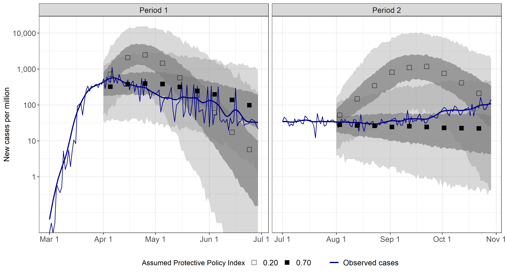

# Replication materials for "Governor's Party, Policies, and COVID-19 Outcomes: Further Evidence of an Effect"

Shvetsova, Olga, Andrei Zhirnov, Frank Giannelli, Michael Catalano, and Olivia Catalano. 2021. "Governor's Party, Policies, and COVID-19 Outcomes: Further Evidence of an Effect." *American Journal of Preventive Medicine.* [doi:10.1016/j.amepre.2021.09.003](https://doi.org/10.1016/j.amepre.2021.09.003)

## Data-files
**/data/PM_data.RData** includes 2 objects of class "data.frame":

**csts.df**: state-level variables that vary by day
* state: state abbreviation
* date: date
* ppi: total PPI
* ppi.s: subnational PPI
* ncases: number of new cases
* cases: cumulative number of cases

**cs.df**: state-level variables that do not vary by day (see the Supplementary Information file for the sources)
* state: state abbreviation
* w_rural: Rural population
* w_hispanic: Share of Hispanic
* w_black: Share of Blacks
* w_senior: Share of population over 65
* w_obesity: Prevalence of obesity
* w_smoke: Prevalence of smoking
* w_asthma: Prevalence of asthma
* w_heart: Share of heart disease deaths
* w_actph: Number of active physicians per 100,000
* w_density: Population density
* w_poverty: Share of population below the poverty line
* w_rep: Republican governor
* w_region: Region
* w_popdoc: Number of people per physician
* negtests: Negative tests from May to November
* negtests.pc: Negative tests from May to November per capita
* pop: Total population

## Code
*/code/modelV.R* estimates model 1 (model 4 without additional control variables)

*/code/modelW.R* estimates model 2 (model 3 without additional control variables)

*/code/modelX.R* estimates model 3 (model 4 with the underreporting parameter fixed at 1)

*/code/modelY.R* estimates model 4 (Full model without the parameterization of the underreporting parameter)

*/code/modelZ.R* estimates the Full model (with a 3-day lag on PPI)

*/code/modelZ_2.R* estimates the Full model (with a 7-day lag on PPI)

*/code/modelZ_3.R* estimates the Full model (with a 14-day lag on PPI)

*/code/model_PPI_by_governor.R* estimates the model connecting governors' parties to PPI

*/code/figure 1.R* produces Figure 1

*/code/figures 2 and 3.R* produces Figures 2 and 3

*/code/make tables.R* summarizes the posterior samples to produce tables

## Illustrations from the paper

** The difference between the simulated case dynamics when the policies are more or less stringent **

** The dynamics of average policy stringency by state type **

